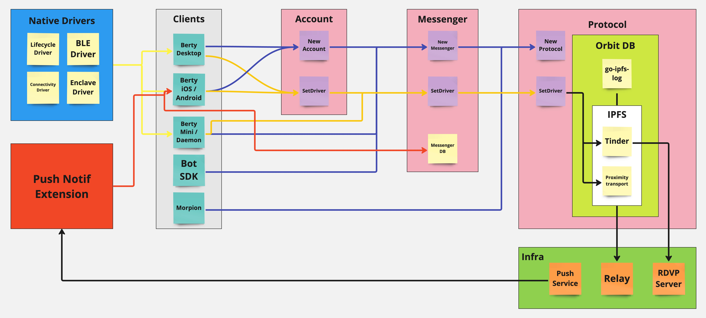

<h1 align="center">
  
</h1>

<h3 align="center"> Berty is an open, secure, offline-first, peer-to-peer, and zero trust messaging app </h3>

<p align="center">
  <strong>Berty</strong> is a privacy-first, censorship-resistant messenger designed to work anywhere — even without internet — using peer-to-peer tech and strong end-to-end encryption.
</p>

<p align="center">
    <a href="https://berty.tech"></a>
    <a href="https://crpt.fyi/berty-discord"></a>
    <a href="https://github.com/berty"></a>
    <a href="https://twitter.com/berty"></a>
</p>
<p align="center">
    <a href="https://github.com/berty/berty/actions?query=workflow%3AJS"></a>
    <a href="https://github.com/berty/berty/actions?query=workflow%3AGo"></a>
    <a href="https://github.com/berty/berty/actions?query=workflow%3AProtobuf"></a>
    <a href="https://github.com/berty/berty/actions?query=workflow%3ARelease"></a>
    <a href="https://github.com/berty/berty/actions?query=workflow%3AAndroid"></a>
    <a href="https://github.com/berty/berty/actions?query=workflow%3AiOS"></a>
    <a href="https://github.com/berty/berty/actions?query=workflow%3AIntegration"></a>
</p>
<p align="center">
  <a href="https://pkg.go.dev/berty.tech/berty/v2/go?tab=subdirectories"></a>
  <a title="Crowdin" href="https://translate.berty.community"></a>
  <a href="https://github.com/berty/berty/releases"></a>
  <a href="https://www.codefactor.io/repository/github/berty/berty"></a>
</p>

---

---

## Quick Start: Install Berty!

### Mobile

Install the latest official release from:

- [Google Play Store](https://play.google.com/store/apps/details?id=tech.berty.android)
- [Apple App Store](https://apps.apple.com/tt/app/berty/id1535500412)

To build and run the mobile app yourself, check the [js/README.md](js/README.md).

### Command Line Interface (CLI)

You can run or install the CLI tools written in Go:

```bash
go install ./go/cmd/berty@latest
berty mini       # Start a CLI messenger
berty daemon     # Run a full node daemon
```


## Introduction

> **Warning:** Berty is under active development and not recommended for sensitive data yet.

**Berty** is a privacy-first messenger built on the [Wesh Protocol](https://berty.tech/docs/protocol/), designed to offer:

- End-to-end encrypted messaging with minimal metadata.
- No phone number or email needed.
- Resilience against censorship and adversarial networks.
- Offline-first, peer-to-peer communication via Bluetooth Low Energy and mDNS.

### Why Use Berty?

- Share sensitive information safely on untrusted networks.
- Communicate anonymously without revealing your identity.
- Control your data without relying on third-party servers.
- Operate in countries with network censorship or surveillance.
- Stay connected where internet is weak or unavailable.

Berty is developed by **[Berty Technologies](https://berty.tech/about)**, a French nonprofit organization dedicated to secure communication for all.

> We’re a small team, always improving. Please report bugs or request features!

### Philosophy

We envision a world where secure, free communication is the norm, without fear of censorship or surveillance.

Open source is core to security: anyone can audit and improve Berty. Our goal is to transition ownership to a global community.

Learn more at [berty/community](https://github.com/berty/community).

## Development Status

The current Berty implementation is using the [Wesh Protocol](https://berty.tech/docs/protocol/), which means the encryption technique is safe, and it works as a peer-to-peer app!

Alas, Berty has not yet been hardened, so please avoid using it on devices with weak sandboxes, such as unpatchable devices that use old Android versions.

The current Wesh Protocol is _partially implemented_.

The API will continue to evolve in the near future. As such, we cannot yet guarantee none-breaking changes, or any kind of API stability. Be prepared for a rough ride if you start rolling the Wesh Protocol in your application.

_[Subscribe](https://tech.us20.list-manage.com/subscribe/post?u=5ca3993c7f0b8f646dcda714b&id=4d7828715b) to our newsletter if you wish to be notified about the latest features and releases._

**Note: The repositories are being opened progressively, and there will be additional modifications and updates soon.**

## Under the hood



### Wesh Protocol

[](https://pkg.go.dev/berty.tech/berty/v2/go/pkg/bertyprotocol?tab=doc)
[](https://codecov.io/gh/berty/berty)

The Wesh Protocol comes with a generic, but full-featured SDK allowing developers to write peer-to-peer applications. You can just focus on high-level features for your app, we will take care of the rest (encryption, identities, network routing, group management, account management, device management, application lifecycle).

The main concept of the _Wesh Protocol_ is called the "group", a virtual place where multiple devices can share messages and metadata using [OrbitDB](https://github.com/orbitdb), which itself relies on the InterPlanetary File System ([IPFS](https://en.wikipedia.org/wiki/InterPlanetary_File_System))

<!-- _TODO: add usage examples_ -->

Get it:

```
git clone https://github.com/berty/berty
```

### The Berty Messenger

[](https://codecov.io/gh/berty/berty)

The Berty Messenger, or simply Berty, is a messaging application written in [React Native](https://reactnative.dev/), that uses the Wesh Protocol through [gomobile-ipfs](https://github.com/ipfs-shipyard/gomobile-ipfs), which, in turns, is using [gomobile](https://github.com/golang/mobile).

## Main items in the repo

- [./go](go): Where all the Golang code lies.
  - [./go/framework/bertybridge](go/framework/bertybridge): The gomobile entrypoint.
  - [./go/cmd/**berty**](go/cmd/berty): The main **Berty CLI**:
    - `berty daemon`: Runs the whole Wesh Protocol instance.
    - `berty mini`: Simple CLI messenger application using Wesh Protocol.
  - [./go/cmd/**rdvp**](go/cmd/rdvp): A Rendez-Vous Point server.
  - [./go/cmd/**welcomebot**](go/cmd/welcomebot): An onboarding bot used during the early phase.
  - [./go/cmd/**testbot**](go/cmd/testbot): A bot used by integration tests and developers.
- [./js](js): Where all the Javascript/Typescript code lies:
  - The **Berty Messenger** application, written in React Native.
- [./docs](docs): Mostly auto-generated documentation.

## Contributing


Contributions are warmly welcomed! Whether you code or support the community, your help is invaluable.

- Code contributions happen on GitHub.
- Non-code contributions and suggestions can be opened as tasks.

See the full guide: [CONTRIBUTING.md](https://github.com/berty/community/blob/master/CONTRIBUTING.md).

Your participation helps make Berty better for everyone!
## Stargazers over time

[](https://star-history.com/#berty/berty&Date)

## Other resources

- Official website: https://berty.tech
- Assets: https://assets.berty.tech/
- Application assets & mockups: https://assets.berty.tech/categories/app__v2.4/

## Support & Contact

For help or questions:

- Visit our [community repository](https://github.com/berty/community)
- Join us on [Discord](https://crpt.fyi/berty-discord)
- Reach out via our [contact page](https://berty.tech/contact)

Stay up to date with the latest by subscribing to our [newsletter](https://tech.us20.list-manage.com/subscribe/post?u=5ca3993c7f0b8f646dcda714b&id=4d7828715b).
## Licensing

© 2018-2023 [Berty Technologies](https://berty.tech)

Licensed under the [Apache License, Version 2.0](https://www.apache.org/licenses/LICENSE-2.0) ([`LICENSE-APACHE`](LICENSE-APACHE)) or the [MIT license](https://opensource.org/licenses/MIT) ([`LICENSE-MIT`](LICENSE-MIT)), at your discretion. See the [`COPYRIGHT`](COPYRIGHT) file for more details.
