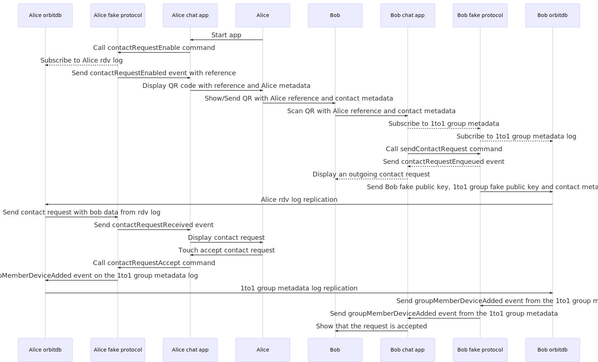

# Chat MVP

## Reading linked graphs

### Account group/log back and forth ignored

Sending an event from the protocol to the app actually requires the app to subscribe to the account log, the protocol then adds the events it wants to send to the app on the account log. It was simplified by drawing an edge from the protocol to the app directly

## Contact request

