# Berty protocol

## Introduction

This document provides a technical description of the Berty Protocol.
The Berty Protocol provides secure communication between devices owned by the
same account, communication between contacts in one-to-one conversations,
as well as communication between several users in multi-member groups. This
paper will explain how those points are implemented in a distributed and
asynchronous way, both with or without internet access using IPFS and direct
transports such as BLE. It will also describe how the Berty Protocol provides
end-to-end encryption and perfect forward secrecy for all the exchanged messages.

> :warning: Warning
>
> The implementation of the protocol is still in progress. Some features described
> in this document are not implemented yet.
>
> This protocol has still not been thoroughly audited and some points are bound to
> evolve with time and feedback.
>
> Nevertheless, we are confident enough about the progression of the protocol
> design to say that the majority of these specifications should remain the same.
>
> If a security expert reads this document and wishes to provide us with some
> feedback, we look forward to reading it. Please contact us using one of the
> means listed on this page: [berty.tech/community#-how-to-contact-us](https://berty.tech/community#-how-to-contact-us)

## Protocol Stack

### IPFS

#### Properties

[IPFS](https://ipfs.io/) is a peer-to-peer network for storing and sharing data
in a [distributed](https://berty.tech/blog/decentralized-distributed-centralized/)
file system. Here is a very succinct description of how IPFS works:

* Each peer has an identity key pair
* Each peer identifies itself using a peerID (basically, a hash of its identity
public key).
* Each content is identified using a contentID (basically, a hash of the content).
* A peer can make a locally stored content available on the network, announcing
that a given contentID is provided by its peerID, so other peers can connect to
it and fetch the content.
* Once a peer has fetched the content over IPFS, it can also become a provider
for this content, thus increasing its availability.
* To make it all work, IPFS uses the [libp2p network stack](https://libp2p.io/)
which provides everything that is needed to create a p2p application: DHT,
PubSub, Nat Traversal, a collection of transports, etc...

#### Implications

Berty uses IPFS for the specific purpose of instant messaging. The utilization
of a peer-to-peer network for instant messages provides two main advantages:

* **It is virtually impossible to block it or take it down**: anyone can launch a
node in a few seconds on their computer and two nodes within the same LAN are
still able to communicate and operate without internet access, whereas in a
centralized model, it is easier to block access to the servers of the company
concerned, or even to force it to shut down its servers and stop its activity.
* **It is difficult to monitor**: there is no central server to spy on nor central
directory to compromise, thus metadata collection is greatly minimized. Instead
of a directory linking public keys to personal data such as telephone numbers,
the Berty Protocol uses a combination of TOTP and a public key to generate
rendezvous point addresses and register its users on IPFS, who can later be
contacted by peers wishing to communicate.

However it also brings several technical constraints:

* **Content availability**: since there is no central storage, all the messages
are stored on the users devices and it is impossible to access content stored
on a device that is offline or unreachable from a given network.
* **Asynchrony**: there is no central server to rule over the timeline, and
therefore timestamps cannot be used for any purpose other than non-critical
tasks like displaying messages in a certain order. For example: expiration time
cannot be used to revoke access to a resource, it is impossible to determine
with certainty the order in which operations occurred within a group of peers, etc...
* **Authority**: there is no central authority to arbitrate operations and any
resulting conflicts or to manage user identity and permissions.

> :warning: Warning
>
> For the moment, IPFS is not privacy-focused and since it is a peer-to-peer
> network, any peer can for instance resolve a peerID to its associated public IP
> address. On the protocol layer, we can only mitigate this problem by rotating
> the peerID of the user regularly, rotating rendezvous points that peers use to
> meet and synchronize with each other and by making it difficult to establish a
> relationship between the data shared by users.
>
> In the near future, we plan to invest some time to see to what extent, and with
> what constraints and implications, it would be possible to add an optional mode
> to the protocol in which connections are anonymized through networks like I2P,
> Tor or equivalent.

### Rendezvous Point

A rendezvous point is a volatile address on a peer-to-peer network where two
devices can meet. Peers can register their peerIDs on a given rendezvous point
and/or get the list of already registered peers. In this way peers who, for
example, need to connect together to exchange messages within a conversation,
could find each other.

Peers need to be able to generate on their own, the same address for a given
rendezvous using previously shared secrets.

In the Berty Protocol, the address of a rendezvous point is generated from two
values:

* A resource ID
* A time-based token generated from a 32-byte seed

The generation of the time-based token follows the core principles of the
[RFC 6238](https://tools.ietf.org/html/rfc6238).

```go
// golang
func rendezvousPoint(id, seed []byte, date time.Time) []byte {
    buf := make([]byte, 32)
    mac := hmac.New(sha256.New, seed)
    binary.BigEndian.PutUint64(buf, uint64(date.Unix()))

    mac.Write(buf)
    sum := mac.Sum(nil)

    rendezvousPoint := sha256.Sum256(append(id, sum...))

    return rendezvousPoint[:]
}
```

There are two types of rendezvous points in the Berty Protocol:

* [**Public rendezvous point:**](#contact-request) This rendezvous point is
used by an account to receive contact requests. The resource ID used here is
the Account ID and the seed can be renewed at will by the user, so it is
possible to revoke the ability to send contact requests to users having only
the previous seed.
* [**Group rendezvous point:**](#invitation) This rendezvous point is used to
exchange messages within a group. The resource ID used here is the Group ID,
and the seed cannot be changed.

The protocol relies on three different rendezvous point systems:

* **DHT-based**: fully distributed, virtually impossible to shutdown, can
operate without internet access but can be slow, especially for mobile usage.
* **Decentralized servers**: not p2p / distributed, can be shut down easier
than a DHT, can't be reached offline but is a lot faster.
* **Local record**: used in combination with direct transports such as
Bluetooth Low Energy. To make it simple, it consists of a process where a peer
is sending its rendezvous point list to the peers it connects to via a direct
transport. The advantage is that it works in this particular case with almost
instantaneous results, but the disadvantage is that it raises privacy
concerns. We are still working on this process to improve this point.
More info in [Specificities of direct transport](#specificities-of-direct-transport)
section.

### Direct Transport

When there is no internet access it is still possible to communicate using
direct transports, given some physical constraints of distance. These
transports integrate directly with IPFS and more precisely with its network
layer: libp2p.

Those direct transports are built on top of Android Nearby for Android
devices, Multipeer Connectivity for iOS devices and
[Bluetooth Low Energy (BLE)](https://berty.tech/blog/bluetooth-low-energy/)
for inter-OS communications. With Android Nearby and Multipeer Connectivity,
messages can be exchanged over a Wi-Fi direct connection instead of BLE which
is much faster and reliable.

It is possible to fully use the Berty Protocol without ever accessing the
Internet: create an account, add contacts to it, join conversations and send
messages as long as there are Berty users within a Bluetooth range.

### Conflict-free Replicated Data Type

Since it is possible to communicate both online and offline using direct
transport, it is necessary to have a way to keep coherence and order between
all the messages, especially in a conversation with several participants. For
example, if Alice and Bob are in a chat group with several other persons and
they both lose internet connection by taking the subway, they can still
communicate with each other in this same conversation using BLE, creating a
parallel version of this conversation. When they go back online, the BLE
version and the Internet version will have to merge.
It is therefore necessary to use an algorithm that ensures that all peers,
once synchronized, have exactly the same sorted list of messages.

The solution to this problem is [Conflict-free Replicated Data Type](https://en.wikipedia.org/wiki/Conflict-free_replicated_data_type)
(CRDT), which is a data structure allowing a consistent ordering of the
messages on a distributed system. Berty relies on [OrbitDB](https://github.com/berty/go-orbit-db)
which implements CRDT. The CRDT provides optimistic replication and strong
eventual consistency, which assures that once synchronized, every peer will
have the same version of the message list.

Every message is linked to its parent, which is the last message sent in a
conversation by one of the peers connected together at this moment. Problems
appear when an online and an offline version of a conversation are
synchronized: some messages are linked to the same parent and the linked list
becomes a [Directed Acyclic Graphs](https://en.wikipedia.org/wiki/Directed_acyclic_graph).

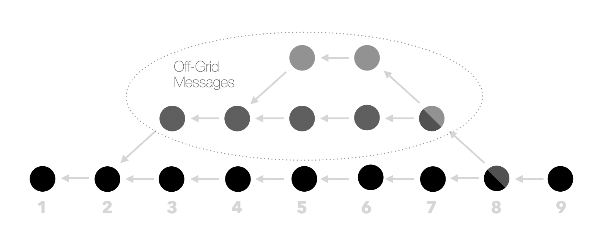

This causes the creation of several parallel branches that will need to be
eventually merged. OrbitDB achieves this by using a [Lamport Clock](https://en.wikipedia.org/wiki/Lamport_timestamp):
each message will include one, and the merged list will be sorted according to
its value.

A Lamport Clock is a struct that consists of two fields: an identity public
key and a counter that is incremented for each message posted by the
associated user/identity.

```go
// golang
type lamportClock struct {
    time int
    id   crypto.PublicKey
}
```

The comparison function is very simple, it will first check the distance
between the counter values and if there is none, it will check the
lexicographic distance between the identity public keys, knowing that a given
identity can't post two messages with the same counter value.

```go
// golang
func compareClock(a, b lamportClock) int {
    dist := a.time - b.time

    if dist == 0 {
        dist = comparePubKey(a.id, b.id) // Returns lexicographic distance
    }

    return dist
}
```

## Account

### Account Creation

In order to use the Berty Protocol, a user will have to create an account. No
personal data is required for the Account Creation. Please note that in the
whole Berty Protocol, all key pairs will be X25519 for encryption and Ed25519
for signature. See the [Cryptography](#cryptography) section for more details
about this choice.

**Account creation steps:**

1. Generate Account ID Key Pair. This operation will not be repeated. This key
pair is the identity of the account, hence it is not possible to change it.
2. Generate Alias Key Pair. Operation will not be repeated. More details on
Alias Key Pair in [*Alias Identity*](#alias-identity).
3. Generate Device ID Key Pair on device used for account creation. This
operation will be repeated on every new device.
See [*Linking Devices*](#linking-devices) for more information. This key pair
is the identity of the device.
4. Generate Public RDV Seed. The RDV Seed is used to generate an RDV Point to
receive a Contact Request. See [*Adding Contacts*](#adding-contacts) for more
information. This operation can be repeated anytime.

Since there is no central directory, it is not required to have access to the
Internet in order to create an Account and send/receive a contact request. If
two users create their Account offline and then connect via direct transport,
they will exchange their public rendezvous points (used for contact requests)
and will therefore be able to add each other as a contact.

**Note**: In this paper, an "ID" will always denote the public key of a key pair.

### Linking Devices

In the Berty Protocol, a user can use multiple devices within the same
account, which means that those devices need to be linked with each other in
order to synchronize the Account's contact list, group list, settings, etc...
To add a device B, to an existing Account on a device A, the linking steps
below will be followed.

**Linking steps:**

1. First step is to generate a Device ID key pair on the new device B.
2. Then device A has to generate an invitation containing A's peerID, for
example, in the form of an URL or a QRCode.
3. Device B must scan the QRCode or follow the URL provided by A to retrieve
A's peerID, establish a connection with A and then send to A a linking request
containing B's Device ID, initiating the following handshake:

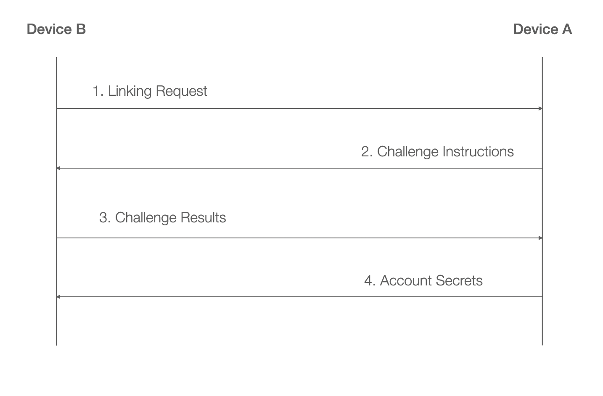

#### Challenges

There are three different types of challenges that A can send to B:

1. **QRCode:** B must display a QRCode containing the fingerprint of its
Device ID and the user must scan this QRCode with device A. If the QRCode
matches the ID that A previously received, then the linking is successful. If
device A possesses a functioning camera, this challenge shall be preferred
because it is both more secure and convenient for the user (there is no error
possible while checking the ID and it requires minimal effort from the user).
2. **PIN:** A must display a PIN that the user has to enter on device B. Then
B sends to A the signature of the PIN using its Device ID. Finally, A verifies
the signature of the PIN using B's Device ID then the linking is successful.
This challenge is secure but less convenient for the user (an active
confirmation is required).
3. **Fingerprint:** B and A must display a fingerprint of B's ID then the user
will have to verify manually that the two fingerprints are the same and
confirm it using a checkbox. This challenge is less secure because the user
can confirm the equality without carefully reading the fingerprints, so it
shall not be proposed to the user, unless they want to automate this process,
for example, in the context of linking a range of servers to an Account with a
script that could automatically check that the fingerprints match.

We recommend to developers implementing an application using the Berty
Protocol to follow this state diagram to choose a challenge on Device A:

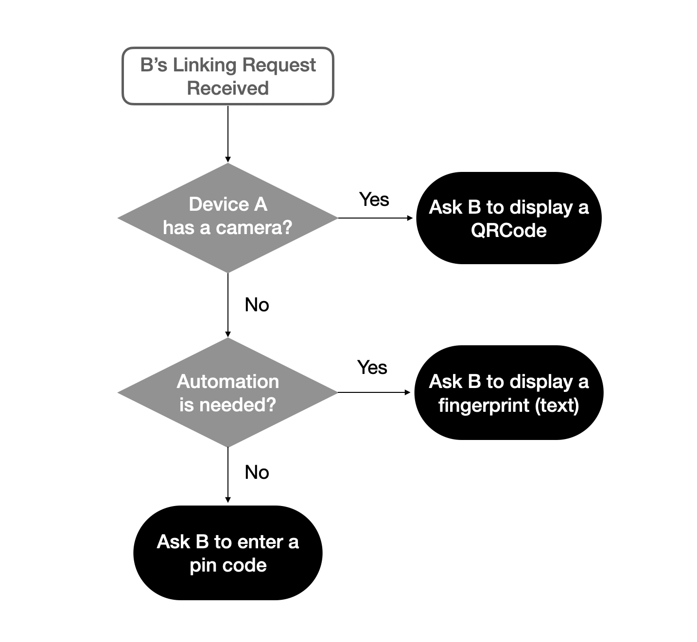

#### Limitations

* **Device revocation:** Please note that it is impossible to revoke a device.
Once a device has been linked, it is in possession of the same information and
secrets as every other device. Hence it has the same capabilities as every
other device, for example the capability to link other devices, send messages,
join groups or add contacts. There is no hierarchy between devices linked to
an account.
* **Device synchronization:** Since Berty is an asynchronous protocol, two
devices need to be online at the same time to be synchronized. However, it is
possible to palliate this problem using replication devices, whose sole
purpose is to provide high availability for content. Those devices are not
able to decrypt messages and all they can do is verify their authenticity
(see [*High Availability*](#high-availability) for more information).

### Adding Contacts

If an Account A wants to start a one-to-one conversation with an Account B, it
will have to add B as a contact first.
A will have to send a contact request to B that B will have to accept before
the conversation can begin

#### Contact Request

When an Account A (the Requester) wants to add an Account B (the Responder) to
its contacts, it needs to know the Responder's Public rendezvous point. This
[rendezvous point](#rendezvous-point) is derived from the RDV Seed and the
Account ID. Thus the Responder first needs to share his RDV Seed and his
Account ID with the Requester, so that the latter can compute the RDV Point.
This information can be sent by different means: an URL sent by message, a
QRCode displayed on the Responder's device and scanned by the Requester's
smartphone, etc...

The Responder can renew their RDV Seed at any time. If it does so, the
Requester will not be able to send a contact request anymore unless the
Responder shares its new RDV Seed. The Responder can also completely disable
incoming contact requests by unregistering its devices from its public
rendezvous point.

Once the Requester has computed the Responder's RDV Point, it will be able to
initiate the following Contact Request handshake.

#### Handshake

Here is the handshake which occurs when the Requester sends a Contact Request
to the Responder:

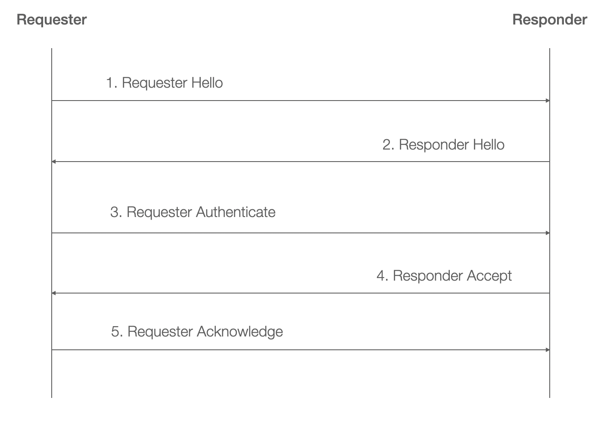

This handshake is widely inspired by [Scuttlebutt's Capability-based Handshake](https://scuttlebot.io/more/protocols/shs.pdf).

##### Starting keys

Here is the list of the keys known by each participant at the beginning of the
handshake:

* Requester knows:
  * $A_s$ and $A_p$: Requester's ID key pair.
  * $a_s$ and $a_p$: Requester's ephemeral key pair.
  * $B_p$: Responder's ID public key.
* Responder knows:
  * $B_s$ and $B_p$: Responder's ID key pair.
  * $b_s$ and $b_p$: Responder's ephemeral key pair.

##### 1. Requester Hello

The Requester sends its ephemeral public key $a_p$ to the Responder. Ephemeral
keys are only used for one handshake and then discarded. They guarantee the
freshness of the messages to avoid replay attacks.


##### 2. Responder Hello

The Responder sends its ephemeral public key $b_p$ to the Requester.


Now both the Requester and the Responder are able to compute two shared
secrets denoted $a.b$ and $a.B$:

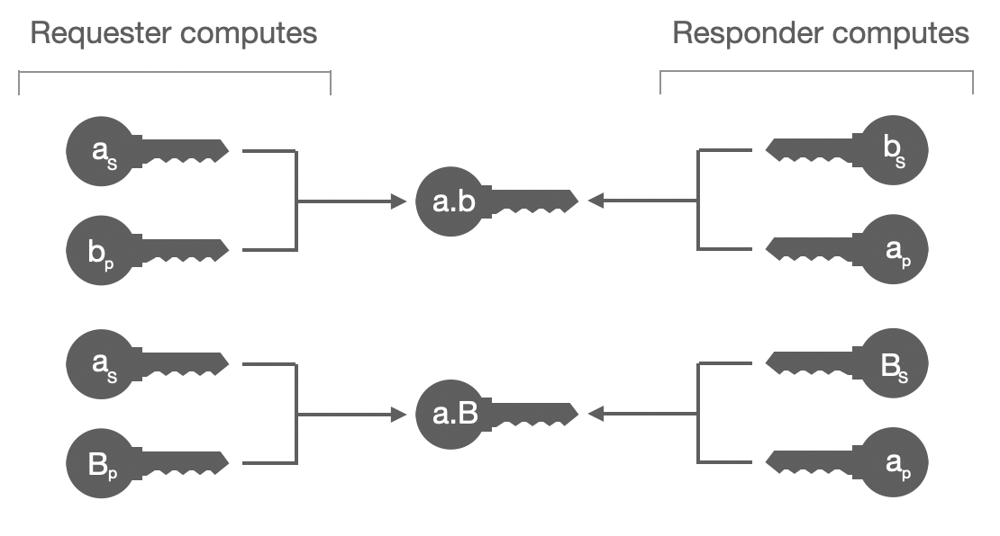

Secrets are derived using the X25519 protocol. Since a man-in-the-middle could
have intercepted the ephemeral keys and replaced them, we need cannot only
rely on $a.b$ and we also need to use $a.B$ in our following exchanges.

##### 3. Requester Authenticate

The Requester sends a secret box containing the signature of $a.b$ along with
their ID public key to authenticate themselves. The secret box is sealed with
$a.b$ and $a.B$, thus in this step the Requester also proves that they know
the Responder's ID.

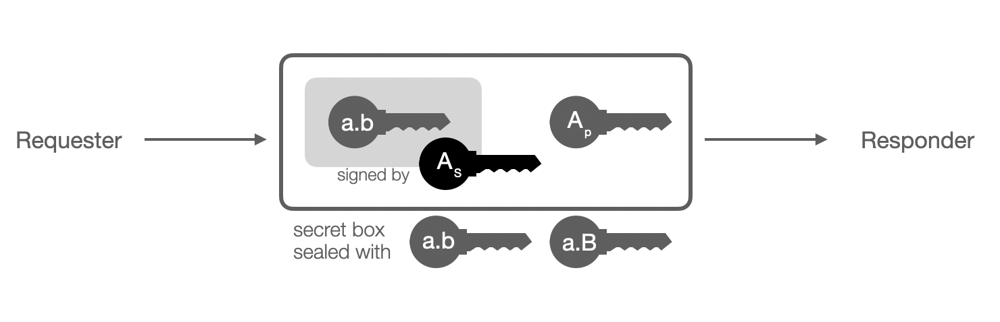

From this step, a man-in-the-middle is no longer able to intercept the
exchanges because they are not able to compute $a.B$, regardless of what they
have done in the previous steps.

Now both the Requester and the Responder are able to compute another shared
secret denoted $A.B$:

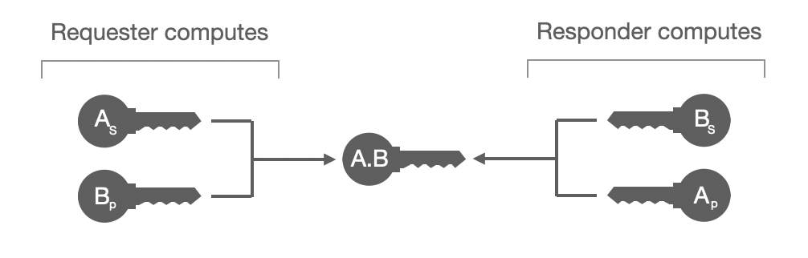

##### 4. Responder Accept

The Responder sends a secret box containing the signature of $a.b$. The secret
box is sealed with $a.b$ and the new secret $A.B$, which proves that the
Responder has effectively received and decrypted the previous message.

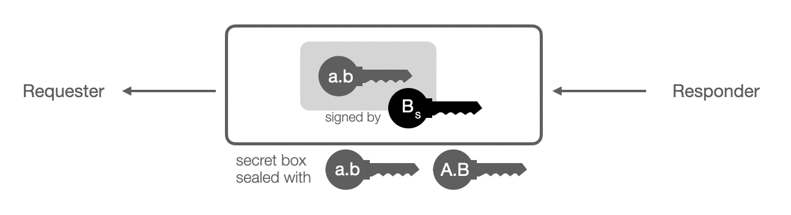

##### 5. Requester Acknowledge

To inform the Responder that the Requester has not encountered any errors
while verifying the contents of the `Responder Accept`, the Requester sends an
acknowledgement. After this step, the handshake is considered valid by both
parties.


##### Security

* **Man-in-the-Middle:** The handshake is not vulnerable to Man-in-the-Middle
Attack. Indeed, the Requester already knows the Responder's identity because
they got it in a trusted way (for example by scanning a QRCode directly from
the Responder's device). To verify each other's identities, the Requester and
the Responder may meet later and check the fingerprint of their shared secret.
* **DDoS Attack:** If the Responder refuses the Contact Request, they can
block the Requester's ID so they cannot initiate handshakes with them anymore.
If the Responder is receiving too many contact requests, they can also change
their RDV Seed and become unreachable using a former RDV Point.
* **Replay Attack:** The use of ephemeral key pairs guarantees that an
attacker cannot reuse a previously stolen message in order to dupe the
Requester or the Responder.

##### Limitations

* **Device availability:** Please note that the Handshake is the only
synchronous operation of the Berty Protocol: in order to succeed, both devices
need to be online at the same time, which is usually the case if the Requester
has scanned a QRCode on the Responder's Device, but which may also not be the
case if the Requester has clicked on a URL received by message. In the case
none of the Responder's devices are available, the Requester must wait and
initiate a handshake later.

## Groups

### Concept

The protocol is strongly based on the concept of group. A group is a logical
structure in which Members and their Devices connect to exchange messages and
metadata.
The metadata are various, some of them inform the group that a new Member or a
new Member's Device has joined the group, others are used to exchange
encryption keys between Members and so on.
Messages and Metadata are exchanged through two immutable logs provided by
OrbitDB.

### Group Structure

A Group is divided into two logs: a message log and a metadata log.

* **Message log:** Contains all the messages exchanged within a Group. Members
of the group can download only a part of the message log if they want to (for
example only the 1000 last messages). Besides, members cannot decrypt messages
sent before their arrival due to the Symmetric Ratchet Protocol
(see [*Encryption*](#encryption) for more information).
* **Metadata log:** Contains all the metadata of the Group. Since it contains
essential information, members of the group shall download the whole metadata
log. Secrets are exchanged on this log.
[Arrivals of new members](#joining-a-group) are also announced on this log, so
if a new member does not download the whole metadata log they will not know
the full list of members, thus they will not be able to exchange secrets with
them and therefore, they will not be able to decrypt their messages.

### Types of Groups

In the Berty Protocol, there are three different types of Groups: Account
Group, Contact Group, and Multi-Member Group. A Group Member is a Berty user
(an account) in a Group. Groups are essential for communication in Berty, and
they have their own keys and secrets shared between all the Group Members:

* **Group Secret:** The Group Secret is a symmetric key used to
encrypt/decrypt group payloads.
* **Group ID Key Pair:** The Group ID is used to derive the Group RDV Point.
The private key is only used to generate the Group Secret Sig and to sign the
creator Member ID, and then it is discarded (Multi-Member Groups only)
* **Attachment key:** The Attachment Key is a symmetric key used to
encrypt/decrypt contentID of files attached to messages. Attachment Key is not
used to encrypt the files.
* **Group Secret Sig:** The Signature of the Group Secret by the Group ID
Private Key (only used in Multi-Member Groups)

#### Account Group

The Account Group is the group of all the devices linked to the same Account.
Devices of the same account need to be in a private group in order to
communicate with each other and share information about the Account, for
example the messages sent and received, the groups joined, the contacts added,
etc... The Account Group is only composed of one Group Member, who is the
account owning all the devices. Every time a new device is linked to the
Account, it joins the Account Group. The keys and secrets of the Account Group
are randomly generated at the creation of the account in the same way as in
Multi-Member Groups.

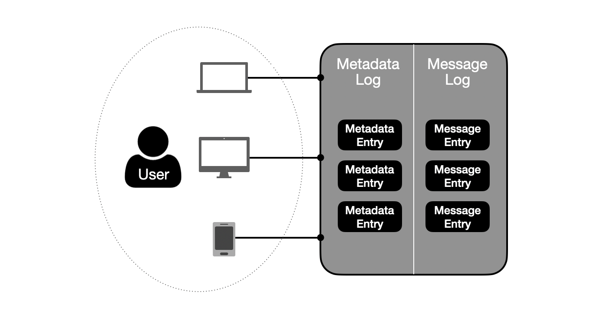

#### Contact Group

A Contact Group is a group consisting of exactly two Group Members who are
Contacts. When an Account adds another Account as a contact, the Contact Group
is created. The Group Secret, Group ID and Attachment Key are generated by the
sender of the Contact Request using X25519 key agreement protocol.


If the secrets were generated the same way as in a Multi-Member Group and
Account-Group (i.e. randomly), the lack of synchronization between devices
could cause the creation of several distinct Contact Groups for the two same
contacts. Let's suppose that the Contact Group secrets are randomly generated
by the group creator. Alice sends to Bob a contact request with her device A1
and Bob accepts the contact request with his device B1. A1 and B1 are now in a
Contact Group with random secrets that A1 shared with B1. Then A1 and B1 are
turned offline and A2 and B2 are turned online. A2 is not aware that the
contact request of Alice has been accepted by Bob, so it sends it again and B2
accepts the new contact request as it is not aware that a contact request has
already been accepted by B1. Again A2 generates random secrets and shares them
with B2, and they are now in a Contact Group which is distinct from the first
Contact Group since the secrets are different. This situation is avoided if
secrets are generated deterministically from Alice’s and Bob's Account ID key
pairs.

#### Multi-Member Group

A Multi-Member Group is a group of several Group Members who may or may not be
Contacts. A particularity of a Multi-Member Group is that users will not be
using their Account ID in the Group, instead they will use a distinct Member
ID, specific to this Group (derived from the Group ID and some secret
accounts). Similarly their devices will use a Member Device ID (randomly
generated). Hence users knowing each other’s Account ID (namely contacts) will
not be able to recognize each other in Multi-Member Groups, unless they want
to (see [Alias Identity](#alias-identity)).

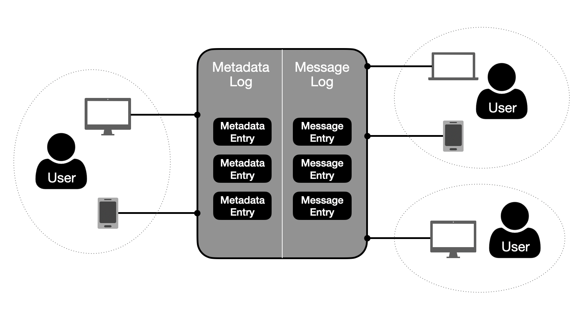

Keys and secrets of the multi-member group are randomly generated at the
creation of the group by the group creator. Once the secrets have been
generated, the group creator posts an Init Member Entry on the Metadata Log:

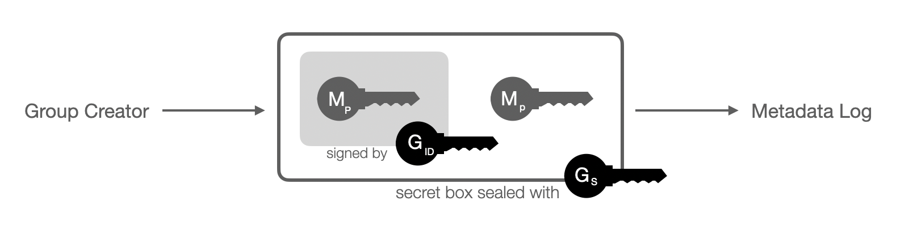

As shown on the schema above, the Init Member Entry consists of a secret box
sealed with the Group Secret ($G_S$) containing the following elements:

* The Member ID public key ($M_P$)
* The signature of the Member ID public key ($M_P$) by the Group ID private
key

It is omitted on the schema but the secret box is signed with a key derived
from the Group Secret and the signature is sent along. It is the case for all
entries posted on the group, to prevent members from trying to decrypt and
store messages sent by outsiders.

After posting this entry on the metadata log, the group creator discards the
Group ID private key. All Members in the Group have the same status, except
the creator of the group who can be identified with this Init Member Entry.
However it does not grant them more rights or capabilities than the other
Members.

##### Alias Identity

In Multi-Member Groups, users will not be using their Account ID in the Group,
instead they will use a distinct Member ID, specific to this Group (derived
from the Group ID and some account’s secret). Similarly their devices will use
a Member Device ID (randomly generated). Hence users knowing someone's Account
ID will not be able to recognize them in Multi-Member Groups. However, if they
want to be identified by their contacts, they can share with the group an
Alias Entry, composed of an Alias Resolver and an Alias Proof:

* **Alias Resolver:** an HMAC of the Alias public Key and the Group ID.
* **Alias Proof:** the signature of the Alias Resolver by the Alias private key.

TODO: Add image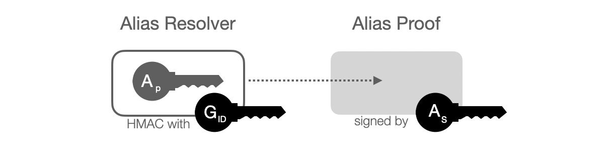

The Alias Key Pair is generated at the creation of the Account and the Alias
Public Key is shared with Contacts once the contact request has been accepted.
With the Alias Entry, everyone within the group who knows someone's Alias
public key will be able to identify their Member ID. When a user joins a new
Multi-Member Group, it computes the Alias Resolver for each of its contacts so
that whenever an Alias Entry is disclosed by another member, the matching is
instant.

Please note that whenever an Alias Entry is disclosed in a Multi-Member Group,
it cannot be undone. An Alias Entry can only be used to identify a member in
one particular Multi-Member Group, since the Alias Resolver is derived from
the Group ID.

## Messages

### Encryption

In the Berty Protocol, all communications are fully end-to-end encrypted using
[Symmetric-key Ratchet](https://signal.org/docs/specifications/doubleratchet/#symmetric-key-ratchet).
Every time a user wants to send a message to someone, a Message Key is derived
from their Chain Key using [HKDF](https://tools.ietf.org/html/rfc5869).
The HKDF also updates the Chain Key after each derivation. The Message Key is
then used to encrypt the message and will not be reused to encrypt other messages.

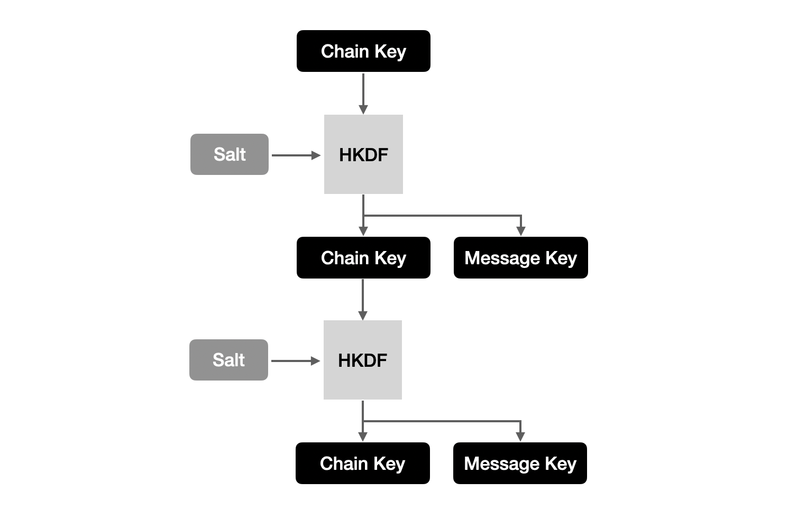

Each member's device within a group has a different Chain Key. The Group ID is
included in the parameters of the HKDF to make the derived keys
[context-specific](https://tools.ietf.org/html/rfc5869#section-3.2). At the
beginning of the conversation members [share their device's Chain Key](#new-member-arrival)
with the other participants. To decrypt messages sent by other participants,
they have to follow the same process and derive the Message Key from the Chain
Key of the sender with the HKDF for every message they receive.

```go
// golang
func deriveNextKeys(currChainKey [32]byte, salt [64]byte, groupID []byte)
   (nextChainKey, nextMsgKey [32]byte) {
    // Salt length must be equal to hash length (64 bytes for sha256)
    hash := sha256.New

    // Generate Pseudo Random Key using currChainKey as IKM and salt
    prk := hkdf.Extract(hash, currChainKey[:], salt[:])
    // Expand using extracted prk and groupID as info (kind of namespace)
    kdf := hkdf.Expand(hash, prk, groupID)

    // Generate next chain and message keys
    io.ReadFull(kdf, nextChainKey[:])
    io.ReadFull(kdf, nextMsgKey[:])

    return nextChainKey, nextMsgKey
}
```

### Joining a Group

To communicate with other devices (or users), a device (or a user) has to join
a group. A device (or a user) can only join a group if it is in possession of
an invitation.

#### Invitation

An invitation is composed of the Group ID, the Group Secret, the Group Secret
Sig and the Attachment Key. An invitation can thus be created by any member of
the Group. With the invitation, a Berty user can compute the [Rendezvous Point](#rendezvous-point)
of the Group, which is derived from the Group ID.

Once the RDV Point has been computed, the user is able to download the
metadata log on the group and decrypt part of its entries with the Group
Secret. He will namely obtain the list of all the Group members, which is
essential to exchange secrets with them and be able to decrypt their messages.

#### New member arrival

Once a user has received an invitation to join a Multi-Member Group and has
downloaded the metadata log, they have to announce their arrival. To do so,
they post a Member Entry for each of their devices on the metadata log:

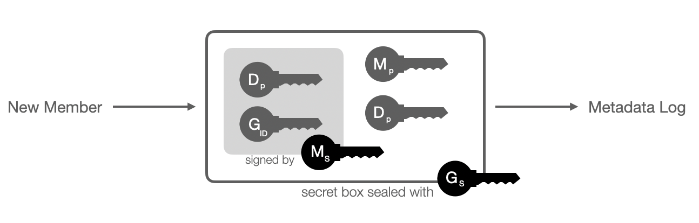

As shown on the schema above, a Member Entry consists of a secret box sealed
with the Group Secret ($G_S$) containing the following elements:

* The signature of the Group ID ($G_{ID}$) and the member device ID public key
($D_P$) by the member ID secret key ($M_S$)
* The Member ID public key ($M_P$) to verify the signature
* The Device ID public key ($D_P$) to authenticate the new member

Now that the new member has announced their arrival, they need to exchange
their chain key with the other members. To do so, for each of their devices
they post a Secret Entry on the metadata log for each member already in the group:

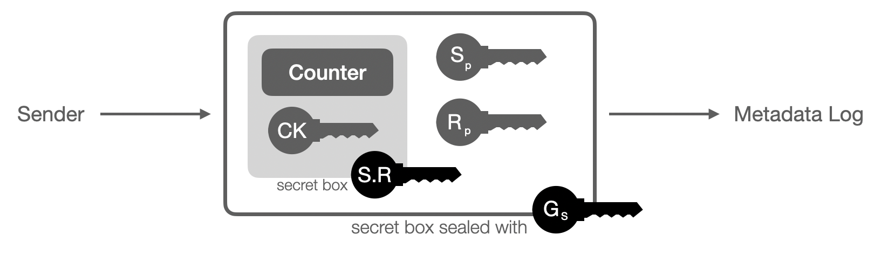

A Secret Entry consists of a secret box sealed with the Group Secret ($G_S$)
containing the following elements:

* The Sender Device ID public key ($S_P$)
* The Receiver Member ID public key ($R_P$) so that everyone within the group
knows to whom the secret entry is addressed to
* A secret box sealed with a shared secret $R.S$ that can be computed by both
the Sender and the Receiver, containing the Sender's Chain Key ($CK$) and its
current counter.

This operation is bilateral, once a member has fetched a Secret Entry on the
metadata log they also post a Secret Entry destined for the new member. In the
end, everyone has the new member's chain key and the new member has the
current chain key of every member of the group.

#### Exchanging messages

Now that every member of the group has the chain key of the new member and the
new member has the chain key of every member of the group, everyone is able to
send and receive messages. To do so, they have to first derive a Message Key
from their Chain Key following the [symmetric ratchet protocol](#encryption).

A Member who wants to send messages to the group has to post a Message Entry
on the Message Log:

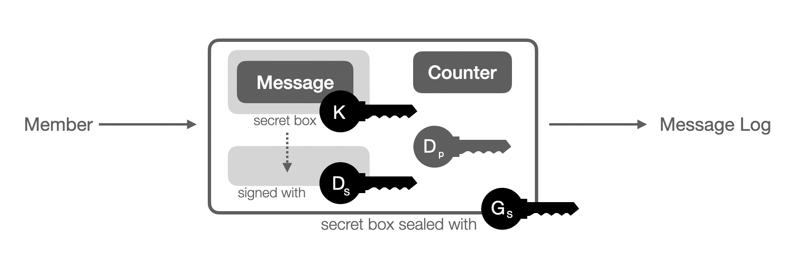

A Secret Entry consists of a secret box sealed with the Group Secret ($G_S$)
containing the following elements:

* A secret box sealed by the message key $K$ containing the message.
* The signature of this secret box with the Device ID secret key ($D_S$).
* The Device ID public key $D_P$ to verify the signature above and identify
the sender.
* The counter corresponding to the message key.

Once a member has fetched a message entry from the message log, they have to
decrypt it using the sender chain key. First they need to rotate the sender's
chain key until they reach the message counter. Then they need to use the
message key to decrypt the message.

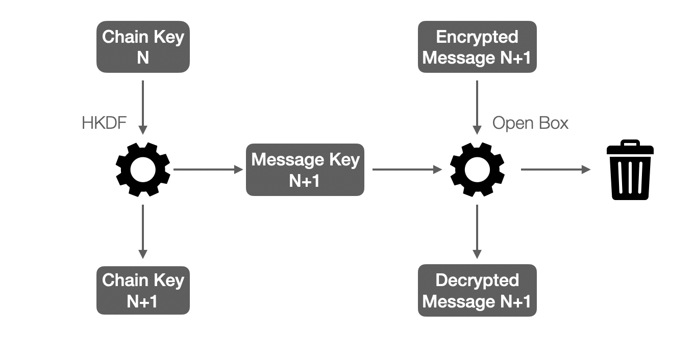

Once the message key has been used, it is discarded because it can decrypt
only one message.

#### Security

* **Forward Secrecy:** New members are not able to decrypt messages sent
before their arrival because the Symmetric Ratchet Protocol grants Forward
Secrecy. Indeed, it is not possible to revert a Chain Key into a previous
state once it has been derived with the HKDF, and thus it is not possible to
obtain a Message Key older than the current Chain Key.

#### Limitations

* **Invitation expiration:** As discussed earlier, there is no expiration time
in the Berty Protocol due to its asynchronous nature. Thus invitations do not
expire, are not nominative and can be used any number of times. Furthermore,
contrary to the Account RDV Point, the Group RDV Point cannot be renewed at
will by the Members and thus cannot be used to escape unwanted arrivals.
* **Member removal:** A member cannot be removed from a group because it would
involve the renewing of all the secrets including the members’ chain keys with
the constraints that the banned member must not know the new secrets exchanged
and that some members may not be synchronized with the rest of the group for a
long period of time. The simplest, less error-prone and clearer way for the
user, is simply to recreate a new group without the unwanted member. Members
can willingly leave a group but for the others, there will be no cryptographic
guarantee that a member has effectively left the group and is not in
possession of the secrets anymore.
* **Scalability:** Since new members have to post a secret entry for every
member of the group and then have to receive a secret entry from every member
of the group, a new arrival in a Multi-Member Group can become a very
expensive process as the Group acquires more and more members. Thus it may be
required to set a member limit in Multi-Member Groups to ensure the effective
functioning of the applications using the Berty Protocol.
* **Post-compromise secrecy:** There is currently no post-compromise secrecy
in the Berty Protocol for the same reason there is no member removal. However,
it could be feasible to renew all the members’ Chain Keys, for example every
hundred messages sent to mitigate an eventual unnoticed compromise.

## High Availability

Since there is no central server in the Berty Protocol, messages and files are
only stored on users devices. Thus, if a certain device has some information
and is offline, other devices will not be able to get this information. For
example, if a user adds a contact with its device A, and turns device A
offline and then uses device B, device B will not be aware of this new contact
and will not be able to communicate with it.

To palliate this problem and provide high availability, the user can set up a
dedicated device with one of the following configurations: bot account, linked
device, replication device and replication server.

### Bot account

A bot account is an account that was created on a dedicated device (e.g a
server) and added to the user account as a contact. The user will have to
manually add the bot contact into all its Multi-Member groups. Since nothing
differentiates a bot account from a user account, this account can do
everything a user account can do, including sending and reading messages. The
bot account provides high availability for Multi-Member groups only, since it
cannot be added to the Contact Group.

### Linked device

A linked device can be dedicated to replication, however it is only a usage
difference, and nothing differentiates this device from the other devices
linked to an account, which means they can read and send messages, as well as
join groups or link new devices to the account. Linked devices provide high
availability for every group the account belongs to.

### Replication device

A replication device is a dedicated device which is linked to an account but
does not get all the account secrets and is not able to send contact requests
or link new devices. It is automatically added to all the groups to which the
account belongs but it does not get any of the group secrets, except the Group
ID public key, the Group Sig and the Attachment Key. Therefore, it is not able
to read messages nor to send them. All it can do is store messages and verify
their authenticity with the Group ID public key, in order to avoid storing
spam messaging from outside the group. It also needs the Attachment Key in
order to decrypt an attachment cID and store the attachment.

### Replication server

A replication server is basically a replication device that is not linked to a
user account but instead is owned and made available by a third party. Anybody
can add an existing replication server to a Group (via an API) to provide high
availability. Like the replication devices, replication servers only get the
Group ID public key, the Group Sig and the Attachment Key when they are added
to the groups, and are thus unable to decrypt the messages.

### Comparison

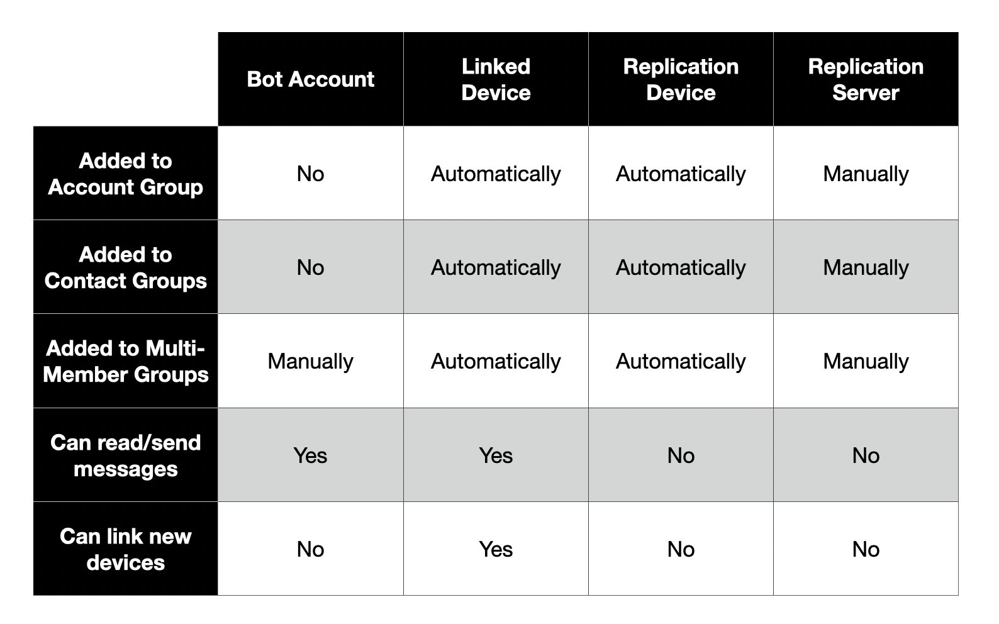

## Implementation Details

### Specificities of direct transport

When a Berty user connects to another Berty user with direct transports, the
first thing they do is send a list of all the RDV Points on which they are
listening: their Public RDV Point (for contact requests) and all RDV Points of
Groups to which they belong. If the second user is already listening on some
of these RDV Points, they will both be able to communicate in those Groups
using direct transports.

For example, if Alice and Bob are contacts, they will both listen on the RDV
Point of their contact group and thus when Alice will send all her RDV Points
to Bob he will see that they have an RDV Point in common, and he will be able
to send her messages within their contact group. The same thing is valid for
Multi-Member Groups.

Thus direct transports are not using a DHT like IPFS and this is a synchronous
communication protocol since both devices need to be connected to each other
in order to exchange messages. This aside, the Berty Protocol works exactly
the same way.

> :warning: Warning
>
> If Alice sends all her RDV Points to Bob, he could make deductions on
> her true identity in Multi-Member Groups. Bob will indeed know all the Groups
> to which he and Alice belong and may be able to link different Member IDs in
> different Groups to Alice.

### Cryptography

#### Key Types

All key pairs used in the Berty Protocol are X25519 for encryption and Ed25519
for signature, for two main reasons:

* These are [smaller](http://ww1.microchip.com/downloads/en/DeviceDoc/Atmel-8951-CryptoAuth-RSA-ECC-Comparison-Embedded-Systems-WhitePaper.pdf)
than RSA key pairs for the same level of security which means, less data to
store and smaller payload to send over the network.
* Elliptic Curve Cryptography is also [faster](http://ww1.microchip.com/downloads/en/DeviceDoc/Atmel-8951-CryptoAuth-RSA-ECC-Comparison-Embedded-Systems-WhitePaper.pdf)
than the RSA algorithm, especially on private key operations, which means less
CPU consumption and thus a longer battery life on mobile devices.

#### Golang Packages

Most of the crypto libs used in the Berty Protocol are packages included in
the standard Go library:

* [crypto/sha256](https://pkg.go.dev/crypto/sha256)
* [crypto/rand](https://pkg.go.dev/crypto/rand)
* [x/crypto/nacl/box](https://pkg.go.dev/golang.org/x/crypto/nacl/box)
* [x/crypto/nacl/secretbox](https://pkg.go.dev/golang.org/x/crypto/nacl/secretbox)
* [x/crypto/hkdf](https://pkg.go.dev/golang.org/x/crypto/hkdf)
* [x/crypto/ed25519](https://pkg.go.dev/golang.org/x/crypto/ed25519)

The only non-standard packages used in the Berty Protocol are the following
two, although they have been written by experts are widely reviewed by the
community:

* [libp2p/go-libp2p-core/crypto](https://pkg.go.dev/github.com/libp2p/go-libp2p-core/crypto)
* [agl/ed25519/extra25519](https://pkg.go.dev/github.com/agl/ed25519/extra25519)
